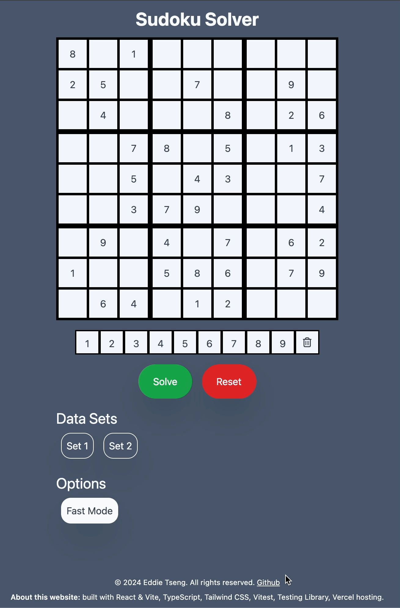

# Sudoku Solver

## Featues
1. Tries to solve simple sudokus by checking the row column and within its own square block.
2. Shows user the next number and solves sudoku sequentially.
3. Adds a toast to let user know that running the solving algorithm was completed or errored out.

## Getting started
1. Use node 20.7+
2. Clone repo
3. Run `npm install`
4. Run `npm run dev`

## Limitations
1. Cannot run on lower node versions.
2. Cannot solve much harder sudokus.